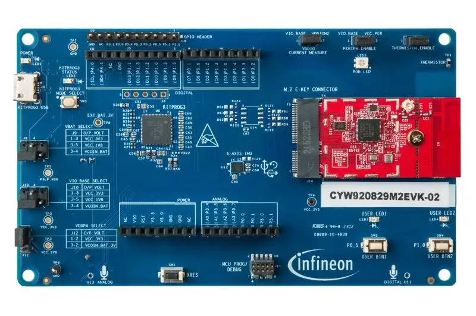

.. _cyw920829m2evk_02:

INFINEON CYW920829M2EVK-02
############################

Overview
********

The AIROC™ CYW20829 Bluetooth® LE MCU Evaluation Kit (CYW920829M2EVK-02) with its included on-board peripherals enables evaluation, prototyping, and development of a wide array of Bluetooth® Low Energy applications, all on Infineon's low power, high performance AIROC™ CYW20829. The AIROC™ CYW20829's robust RF performance and 10 dBm TX output power without an external power amplifier (PA). This provides enough link budget for the entire spectrum of Bluetooth® LE use cases including industrial IoT applications, smart home, asset tracking, beacons and sensors, and medical devices.

The system features Dual Arm® Cortex® - M33s for powering the MCU and Bluetooth subsystem with programmable and reconfigurable analog and digital blocks. In addition, on the kit, there is a suite of on-board peripherals including six-axis inertial measurement unit (IMU), thermistor, analog mic, user programmable buttons (2), LEDs (2), and RGB LED. There is also extensive GPIO support with extended headers and Arduino Uno R3 compatibility for third-party shields.

Hardware
********

For more information about the CYW20829 SoC and CYW920829M2EVK-02 board:

- `CYW920829M2EVK-02 Website`_
- `CYW920829M2EVK-02 BT User Guide`_

Kit Features:
=============

- AIROC™ CYW20829 Bluetooth® LE MCU in 56 pin QFN package
- Arduino compatible headers for hardware expansion
- On-board sensors - 6-axis IMU, Thermistor, Infineon analog microphone, and Infineon digital microphone
- User switches, RGB LED and user LEDs
- USB connector for power, programming and USB-UART bridge

Kit Contents:
=============

- CYW20829 evaluation board (CYW9BTM2BASE3+CYW920829M2IPA2)
- USB Type-A to Micro-B cable
- Six jumper wires (five inches each)
- Quick start guide

Supported Features
==================

The board configuration supports the following hardware features:

+-----------+------------+-----------------------+
| Interface | Controller | Driver/Component      |
+===========+============+=======================+
| NVIC      | on-chip    | nested vectored       |
|           |            | interrupt controller  |
+-----------+------------+-----------------------+
| SYSTICK   | on-chip    | system clock          |
+-----------+------------+-----------------------+
| GPIO      | on-chip    | GPIO                  |
+-----------+------------+-----------------------+
| UART      | on-chip    | serial port-polling;  |
|           |            | serial port-interrupt |
+-----------+------------+-----------------------+

The default configuration can be found in the Kconfig

:zephyr_file:`boards/infineon/cyw920829m2evk_02/cyw920829m2evk_02_defconfig`

System Clock
============

The AIROC™ CYW20829 Bluetooth®  MCU SoC is configured to use the internal IMO+FLL as a source for
the system clock. Other sources for the system clock are provided in the SOC, depending on your
system requirements.

Build blinking led sample
*************************

Here is an example for the :zephyr:code-sample:`blinky` application.

.. code-block:: console

   cd zephyr
   west build -p auto -b cyw920829m2evk_02 samples/basic/blink

SREC_CAT Installation
*********************

The ``srec_cat`` utility is used to generate the application header (post build). Install the utility using the below steps depending on the OS

This can be installed on Linux via:

   .. code-block:: bash

      $ sudo apt-get install srecord

And on OS X via:

   .. code-block:: bash

      $ brew install srecord

For Windows-based systems, please make sure you have a copy of the utility
available on your system path. See, for example:
`SRecord for Windows <https://sourceforge.net/projects/srecord/files/srecord-win32>`_

OpenOCD Installation
====================

To get the OpenOCD package, it is required that you

1. Download the software ModusToolbox 3.2. https://softwaretools.infineon.com/tools/com.ifx.tb.tool.modustoolbox
2. Once downloaded add the path to access the Scripts folder provided by ModusToolbox
   export PATH=$PATH:/path/to/ModusToolbox/tools_x.y/openocd/scripts
3. Add the OpenOCD executable file's path to west flash/debug.
4. Flash using: west flash --openocd path/to/infineon/openocd/bin/openocd
5. Debug using: west debug --openocd path/to/infineon/openocd/bin/openocd

Programming and Debugging
*************************

The CYW920829M2EVK-02 includes an onboard programmer/debugger (KitProg3) to provide debugging, flash programming, and serial communication over USB. Flash and debug commands must be pointed to the Cypress OpenOCD you downloaded above.

On Windows:

.. code-block:: console

   west flash --openocd path/to/infineon/openocd/bin/openocd.exe
   west debug --openocd path/to/infineon/openocd/bin/openocd.exe

On Linux:

.. code-block:: console

   west flash --openocd path/to/infineon/openocd/bin/openocd
   west debug --openocd path/to/infineon/openocd/bin/openocd

Once the gdb console starts after executing the west debug command, you may now set breakpoints and perform other standard GDB debugging on the CYW20829 CM33 core.

.. _CYW920829M2EVK-02 Website:
    https://www.infineon.com/cms/en/product/wireless-connectivity/airoc-bluetooth-le-bluetooth-multiprotocol/airoc-bluetooth-le/cyw20829/

.. _CYW920829M2EVK-02 BT User Guide:
    https://www.infineon.com/cms/en/product/wireless-connectivity/airoc-bluetooth-le-bluetooth-multiprotocol/airoc-bluetooth-le/cyw20829/#!?fileId=8ac78c8c8929aa4d018a16f726c46b26

.. _Infineon OpenOCD:
    https://github.com/infineon/openocd/releases/tag/release-v4.3.0
